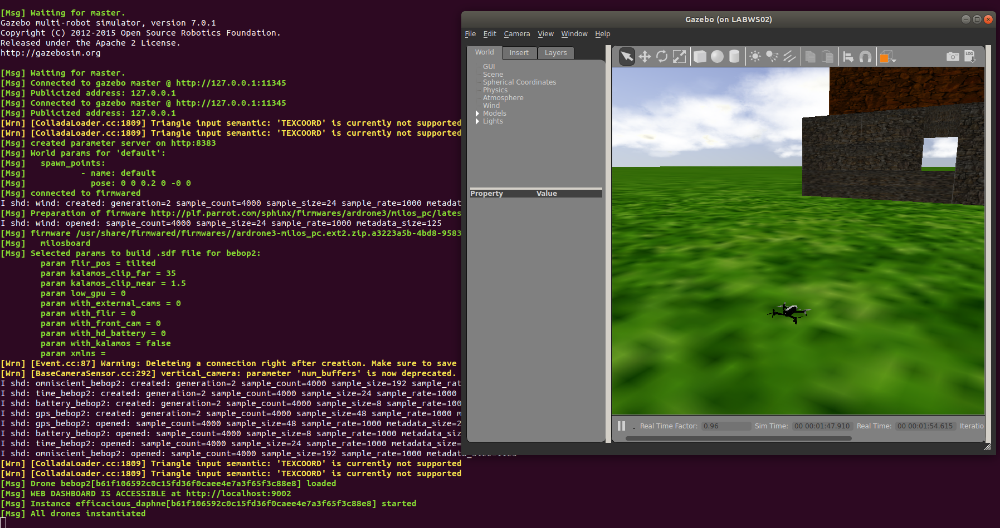

# AppDrone4IoT: Flights Scheduling Service and Trajectory Optimization of UAV as Data Mule

This project aims to provide a uav flight plan through a trajectory optimization algorithm and generate a mavlink file which is used by ROS driver in order to run a simulated flight in sphinx.

## Getting Started

TODO - links to download bebop_autonomy (Driver ROS) and parrot sphinx.

### Prerequisites

TODO - What things you need to install the software and how to install them.

### Installing

TODO - A step by step series of examples that tell you how to get a development env running

TODO - Say what the step will be

## Running simulations

### Starting firmware 

Once you got all steps of the installation you need to start the firmware service.

Before start the firmware service make sure there isn't a instance already running by looking for it.

```
ps ax|grep firmwared
```

If you find two or more it might crash, so stop the service:

```
sudo systemctl stop firmwared.service
```

Start the firmware:

```
sudo systemctl start firmwared.service
```

Verify if it's running:

```
fdc ping
```
The answer must be 'PONG'

### Executing the simulator

If you're running a simulation for Bebop 2, open the configuration file:

```
nano opt/parrot-sphinx/usr/share/sphinx/drones/bebop2.drone

```
I rather to keep the file the same way the installation created. Make sure it looks like this:

```xml
<?xml version="1.0" encoding="UTF-8"?>
<drone
  name="bebop2"
  firmware="http://plf.parrot.com/sphinx/firmwares/ardrone3/milos_pc/latest/images/ardrone3-milos_pc.ext2.zip"
  hardware="milosboard">
  <machine_params
    low_gpu="0"
    with_front_cam="1"
    with_hd_battery="0"
    with_flir="0"
    flir_pos="tilted"/>
  <pose>default</pose>
  <interface>eth1</interface>
  <!-- 'wlan0' may need to be replaced the actual wifi interface name -->
  <stolen_interface>wlan0:eth0:192.168.42.1/24</stolen_interface>
</drone>

```

Some parameters are changed by executing the simulator. 
So you can set false to the use of frontal camera, and pass the Wi-Fi interface name.

For execute the simulator:
```
sphinx /opt/parrot-sphinx/usr/share/sphinx/drones/bebop2.drone::with_front_cam=false::stolen_interface=wlp4s0:wlp4s0:192.168.42.1/24

```

So, you need to wait for the simulator load the drone, it will look like this:




If you wanna see it with a scenario:

```
sphinx /opt/parrot-sphinx/usr/share/sphinx/worlds/outdoor_5.world  /opt/parrot-sphinx/usr/share/sphinx/drones/bebop2.drone::with_front_cam=false::stolen_interface=wlp4s0:wlp4s0:192.168.42.1/24

```

Ping drone:

```
ping 10.202.0.1

```

### Running the ROS driver

Open the launch file 

```
nano /bebop_ws/src/bebop_autonomy/bebop_driver/launch/bebop_node.launch
```

Make sure the configuration looks like this:
```xml
<?xml version="1.0"?>
<launch>
    <arg name="namespace" default="bebop" />
    <arg name="ip" default="10.202.0.1" />
    <arg name="drone_type" default="bebop2" /> <!-- available drone types: bebop1, bebop2 -->
    <arg name="config_file" default="$(find bebop_driver)/config/defaults.yaml" />
    <arg name="camera_info_url" default="package://bebop_driver/data/$(arg drone_type)_camera_calib.yaml" />
    <group ns="$(arg namespace)">
        <node pkg="bebop_driver" name="bebop_driver" type="bebop_driver_node" output="screen">
            <param name="camera_info_url" value="$(arg camera_info_url)" />
            <param name="bebop_ip" value="$(arg ip)" />
            <rosparam command="load" file="$(arg config_file)" />
        </node>
        <include file="$(find bebop_description)/launch/description.launch" />
    </group>
</launch>
```

Running the ROS driver:

```
roslaunch bebop_driver bebop_node.launch ip:=10.202.0.1
```

Sending the mavlink file comprising the flight plan by curl to the ftp server:

```
curl -T test.mavlink ftp://10.202.0.1:61
```

Testing taking-off the drone:

```
rostopic pub --once bebop/takeoff std_msgs/Empty
```

Testing landing the drone:

```
rostopic pub --once bebop/land std_msgs/Empty
```

Requesting the drone to run the flight plan:

```
rostopic pub --once bebop/autoflight/start std_msgs/String test.mavlink
```


## Deployment

TODO - Add additional notes about how to deploy this on a live system

## Authors

* **Lucas Soares**

## Acknowledgments

* Hat tip to anyone whose code was used
* Inspiration
* etc

